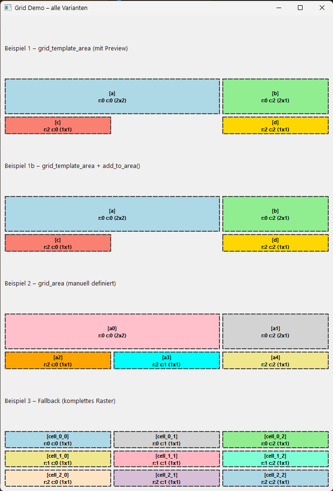

# Dokumentation der Testroutine: Grid Layout Generator (`demo_grid_usage.py`)

Diese Dokumentation beschreibt die erweiterte Test- und Vorschau-Umgebung für den Grid Layout Generator. Sie dient dazu, Layout-Aufteilungen vor der finalen Widget-Zuweisung optisch zu überprüfen und das Zusammenspiel aller Fallback-Modi zu validieren.

## 1. Besondere Test-Features
* **Visuelle Layout-Preview**: Durch die Parameter `preview` und `grid_bg` können die Segmente des Grids temporär mit Hintergrundfarben versehen werden. Das erleichtert die optische Kontrolle von komplexen Spalten- und Zeilenaufteilungen.
* **Widget-Transparenz**: In der Testroutine werden Widgets mittels QSS auf transparent geschaltet, damit die dahinter liegenden Test-Containerfarben vollständig sichtbar bleiben.

---

## 2. Zusätzliche Parameter in der Test-Variante

Im Vergleich zur produktiven Core-API akzeptiert die Test-Schnittstelle des Generators zwei zusätzliche Steuerungs-Parameter:

| Parameter | Typ | Standardwert | Beschreibung |
| :--- | :--- | :--- | :--- |
| `preview` | `bool` | `False` | Aktiviert den Vorschau-Modus. Rendert farbige Hintergrund-Container zur visuellen Layout-Kontrolle. |
| `grid_bg` | `Optional[List[str]]` | `None` | Eine Liste von Farbnamen (z. B. `["lightblue", "pink", "gold"]`), die den erzeugten Bereichen sequentiell als Hintergrundfarbe zugewiesen werden. |

---

## 3. Integrations-Testroutine (demo_grid_usage.py)

Dieses Skript testet alle drei Modi und stellt die Vorschau-Farben dar.

```python
import sys
from PySide6.QtWidgets import (
    QApplication, QMainWindow, QWidget, QVBoxLayout, QLabel, QPushButton, QTextEdit
)
from PySide6.QtGui import QIcon
from subroutines.grid_layout_generator import Grid

class DemoWindow(QMainWindow):
    def __init__(self):
        super().__init__()
        self.setWindowTitle("Grid Demo – alle Varianten")
        self.setWindowIcon(QIcon("/Assets/img/SDaaH-logo.png"))
        self.setGeometry(200, 200, 700, 1000)

        central = QWidget()
        self.setCentralWidget(central)
        layout = QVBoxLayout(central)

        # ----------------------------------------------------------
        # Beispiel 1: grid_template_area (CSS-like)
        # ----------------------------------------------------------
        egc = "."  # empty grid cell
        grid_template_area = [
            ["a", "a", "b"],
            ["a", "a", "b"],
            ["c", egc, "d"],
        ]
        grid_bg = ["lightblue", "lightgreen", "salmon", "gold"]

        layout.addWidget(QLabel("Beispiel 1 – grid_template_area (mit Preview)"))
        layout.addLayout(
            Grid(
                grid_template_rows=3,
                grid_template_cols=3,
                grid_gap=5,
                grid_template_area=grid_template_area,
                grid_bg=grid_bg,
                preview=True,
            )
        )

        # ----------------------------------------------------------
        # Beispiel 1b: grid_template_area + add_to_area()
        # ----------------------------------------------------------
        layout.addWidget(QLabel("Beispiel 1b – grid_template_area + add_to_area()"))

        grid_layout = Grid(
            grid_template_rows=3,
            grid_template_cols=3,
            grid_gap=5,
            grid_template_area=grid_template_area,
            grid_bg=grid_bg,
            preview=True
        )

        # Widgets per Bereichsname einfügen
        grid_layout.add_to_area("a", QLabel("Bereich A – großer Block"))
        grid_layout.add_to_area("b", QPushButton("Button B"))
        grid_layout.add_to_area("c", QLabel("C unten links"))
        grid_layout.add_to_area("d", QTextEdit("D rechts unten"))

        layout.addLayout(grid_layout)

        # ----------------------------------------------------------
        # Beispiel 2: grid_area (manuell definiert)
        # ----------------------------------------------------------
        layout.addWidget(QLabel("Beispiel 2 – grid_area (manuell definiert)"))

        grid_area = [
            (0, 0, 2, 2),  # große Zelle links oben
            (0, 2, 2, 1),  # rechte Spalte oben
            (2, 0, 1, 1),  # unten links
            (2, 1, 1, 1),  # unten mitte
            (2, 2, 1, 1),  # unten rechts
        ]
        grid_bg2 = ["pink", "lightgray", "orange", "cyan", "khaki"]

        layout.addLayout(
            Grid(
                grid_template_rows=3,
                grid_template_cols=3,
                grid_gap=5,
                grid_area=grid_area,
                grid_bg=grid_bg2,
                preview=True,
            )
        )

        # ----------------------------------------------------------
        # Beispiel 3: Fallback (nur rows/cols → komplettes Raster)
        # ----------------------------------------------------------
        layout.addWidget(QLabel("Beispiel 3 – Fallback (komplettes Raster)"))

        layout.addLayout(
            Grid(
                grid_template_rows=3,
                grid_template_cols=3,
                grid_gap=5,
                preview=True,
            )
        )

if __name__ == "__main__":
    app = QApplication(sys.argv)
    
    app.setStyleSheet("""
        /* Sorgt dafür, dass die Test-Widgets im Vorschau-Modus transparent sind */
        QLabel, QTextEdit, QWidget { 
            background: transparent; 
        }
        /* Verhindert, dass das Hauptfenster das Grid verschluckt */
        QMainWindow { 
            background-color: #f0f0f0; 
        }
    """)
    
    w = DemoWindow()
    w.show()
    sys.exit(app.exec())
```

## 4. Visuelle Vorschau des Testergebnisses

Wenn die obige Testroutine ausgeführt wird, rendert PySide6 die vier Beispiele direkt untereinander. Dank der gesetzten Hintergrundfarben und transparenten Widgets lässt sich das Layout perfekt nachvollziehen:



### Was man auf dem Screenshot sieht:
* **Beispiel 1**: Zeigt die leere Struktur der CSS-Matrix. Der Platzhalter `.` bleibt als Lücke (Fensterhintergrund `#f0f0f0`) sichtbar.
* **Beispiel 1b**: Zeigt dieselbe Struktur, aber überlagert mit den echten Widgets (`QLabel`, `QPushButton`, `QTextEdit`) per `add_to_area()`.
* **Beispiel 2**: Visualisiert das manuell übergebene Koordinaten-Raster mit den 5 farbigen Segmenten.
* **Beispiel 3**: Zeigt das automatische Fallback-Raster, bei dem jede Zelle des 3x3-Grids einzeln partitioniert wird.

