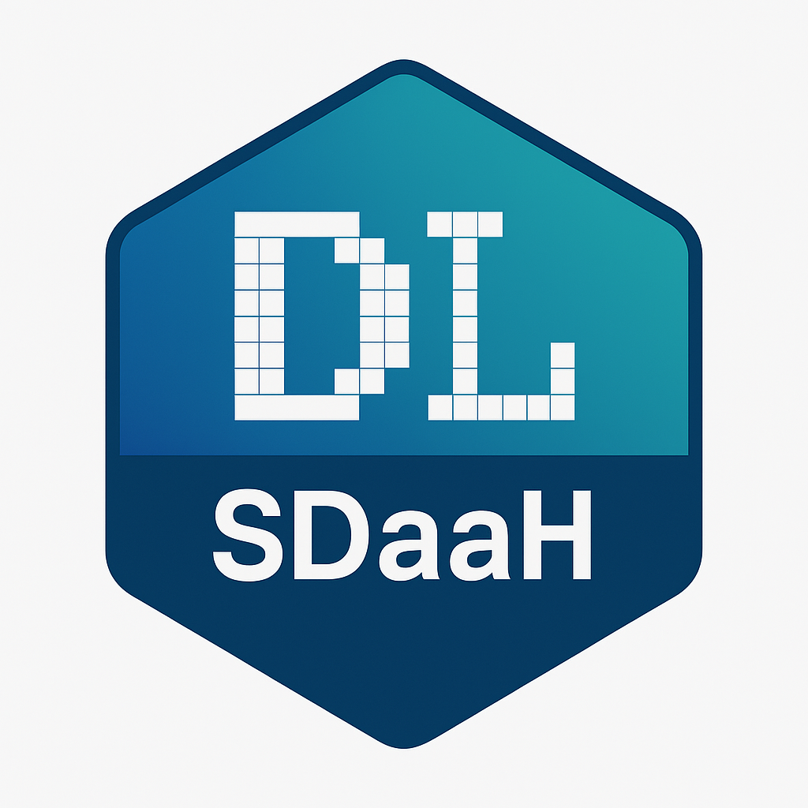

  

# SDaaH – Software Development as a Hobby

**SDaaH** steht für *Software Development as a Hobby* – ein persönliches Projekt von **Dietmar Ley**, entstanden aus der Freude am Programmieren und dem Wunsch, auch im Ruhestand kreativ und neugierig zu bleiben.

Die Idee entstand spontan, als ich für eine Python‑GUI‑Anwendung eine passende Kopfzeile suchte. Der bekannte Begriff *Software as a Service (SaaS)* kam mir in den Sinn – und daraus entwickelte sich spielerisch die Abwandlung **SDaaH**.

Für mich beschreibt SDaaH genau das, was Programmieren für viele bedeutet:
ein kreatives Hobby, das Spaß macht, den Kopf wach hält und immer wieder neue Ideen hervorbringt.

---

## 🎯 Was ist SDaaH?

SDaaH ist kein Produkt, keine Firma und kein kommerzielles Projekt.  
Es ist eine kleine persönliche Philosophie:

> **Programmieren, weil es Freude macht.  
> Lernen, weil es inspiriert.  
> Entwickeln, weil es lebendig hält.**

Hier entstehen kleine Tools, Experimente, Lernprojekte und alles, was mich technisch interessiert – ohne Druck, ohne Verpflichtungen.

---

## 🧩 Ziele des Projekts

- Neues ausprobieren und dazulernen  
- Kleine Softwareideen umsetzen  
- Spaß am Coden behalten  
- Projekte dokumentieren und teilen  
- Kreativität im Ruhestand ausleben  

---

## 👤 Über mich

Ich bin **Dietmar Ley**, Hobby‑Entwickler und neugierig geblieben.  
Auch im Ruhestand begeistert mich Softwareentwicklung – als geistige Herausforderung, als kreatives Werkzeug und als persönliches Hobby.

SDaaH ist mein Platz, um diese Freude sichtbar zu machen.

---

## 📂 Status

Dieses Repository wächst nach Lust und Laune – ganz im Sinne von  
**Software Development as a Hobby**.
