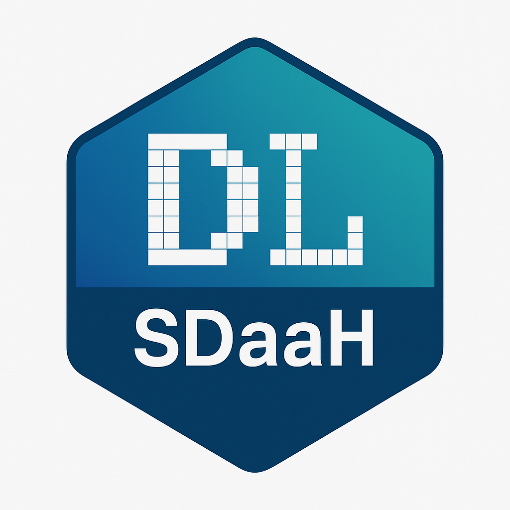

  

# SDaaH – Software Development as a Hobby

**SDaaH** steht für *Software Development as a Hobby* – ein persönliches Projekt von **Dietmar Ley**, entstanden aus der Freude am Programmieren und dem Wunsch, auch im Ruhestand kreativ und neugierig zu bleiben.

Die Idee entstand spontan, als ich für eine Python‑GUI‑Anwendung eine passende Kopfzeile suchte. Der bekannte Begriff *Software as a Service (SaaS)* kam mir in den Sinn – und daraus entwickelte sich spielerisch die Abwandlung **SDaaH**.

Für mich beschreibt SDaaH genau das, was Programmieren für viele bedeutet:
ein kreatives Hobby, das Spaß macht, den Kopf wach hält und immer wieder neue Ideen hervorbringt.

---

## 🎯 Was ist SDaaH?

SDaaH ist kein Produkt, keine Firma und kein kommerzielles Projekt.  
Es ist eine kleine persönliche Philosophie:

> **Programmieren, weil es Freude macht.  
> Lernen, weil es inspiriert.  
> Entwickeln, weil es lebendig hält.**

Hier entstehen kleine Tools, Experimente, Lernprojekte und alles, was mich technisch interessiert – ohne Druck, ohne Verpflichtungen.

---

## 🧩 Ziele des Projekts

- Neues ausprobieren und dazulernen  
- Kleine Softwareideen umsetzen  
- Spaß am Coden behalten  
- Projekte dokumentieren und teilen  
- Kreativität im Ruhestand ausleben  

---

## 👤 Über mich
Ich bin Dietmar Ley, Hobby‑Entwickler und neugierig geblieben. 

Nach einem langen Berufsleben in der Welt der Mainframes (unter anderem als Systemprogrammierer für MVS, OS/390 und z/OS sowie im 2nd-Level-Support bei Amdahl) nutze ich meine Erfahrung in der Fehleranalyse (Problem Determination) nun für private Projekte. Die Faszination für Code lässt mich auch im Ruhestand nicht los – heute jedoch als geistige Herausforderung, kreatives Werkzeug und rein persönliches Hobby.

SDaaH ist mein Platz, um diese Freude sichtbar zu machen.

---

## 🛠️ Aktuelle Projekte

Hier teile ich Werkzeuge, die aus meiner Mainframe-Erfahrung im Bereich Problem Determination entstanden sind, übersetzt in moderne Web- und Desktop-Technologien:

### 🐘 abend-diagnostic (PHP / MVC)
Eine strukturierte Fehlerbehandlung für PHP-MVC-Anwendungen, die stark an die Prinzipien von klassischen Mainframe-Diagnosetools (Abenddump, Snapdump, Debugdump und Trace) angelehnt ist. Sie hilft dabei, Systemzustände im Fehlerfall präzise zu erfassen.

### 🐍 DumpViewer & Grid-Layout (Python / PySide6)
Ein visueller DumpViewer, dessen Benutzeroberfläche auf einem eigens entwickelten, dynamischen `grid_layout_generator` basiert. Das Projekt kommt in zwei Varianten:
1. **Die Testversion:** Ein interaktives Tool, mit dem sich die Grid-Layouts (Grid-Areas, Grid-Area-Templates) vorab visuell anzeigen und prüfen lassen.
2. **Die produktive Version:** Die fertige, performante Oberfläche für den täglichen Einsatz im DumpViewer.

---

## 📂 Status

Dieses Repository wächst nach Lust und Laune – ganz im Sinne von  
**Software Development as a Hobby**.
