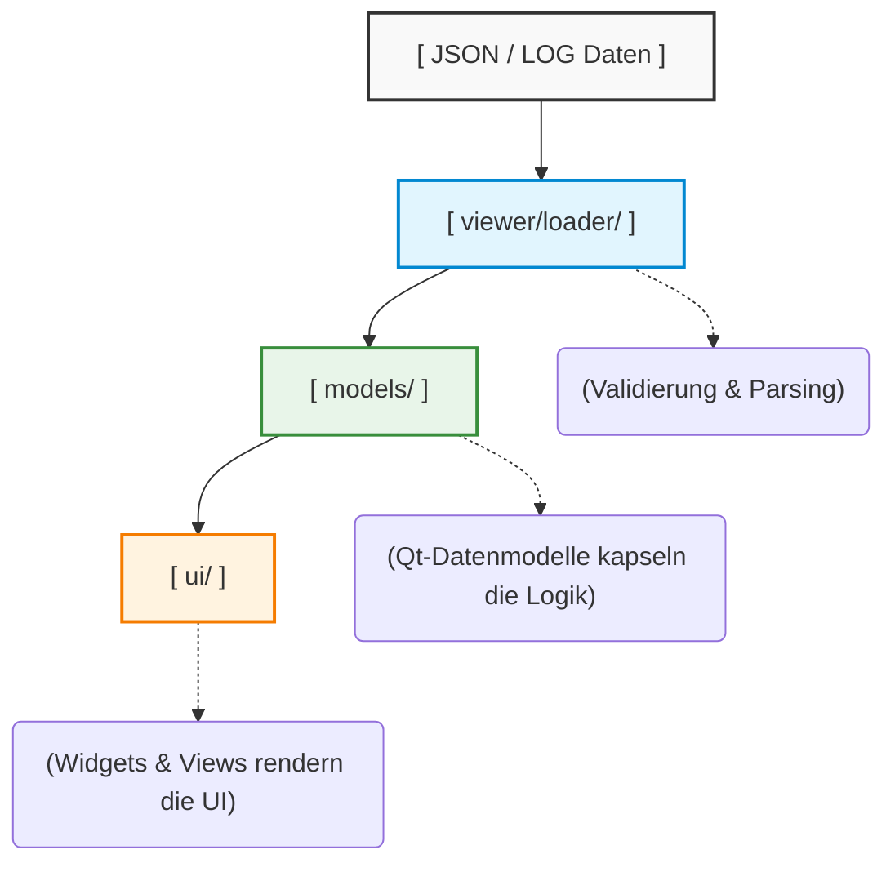

# Technische Dokumentation: PySide6 DumpViewer (Frontend)

Der DumpViewer ist eine hochperformante Desktop-Anwendung auf Basis von **Python 3.13 und PySide6 (Qt for Python)**. Er dient der grafischen Aufbereitung, Analyse und Visualisierung der vom PHP-Diagnose-Subsystem generierten ABEND-, SNAP- und Debug-Dateien.

## 🏗️ 1. Architektur-Muster & Datenfluss

Die Anwendung folgt strikt dem **Qt Model/View-Muster**. Dies garantiert eine vollständige Trennung zwischen den rohen JSON-/Log-Daten und der grafischen Darstellung (UI). Dadurch bleibt das Interface selbst bei extrem großen Stacktraces oder tief verschachtelten Variablen-Strukturen vollkommen blockierungsfrei und responsiv.

1. **Loader-Schicht (`viewer/loader/`)**: Spezialisierte Loader (`abend_loader.py`, `snap_loader.py`, `debug_loader.py`) lesen die Dateien asynchron ein und bereiten die Datenstrukturen vor.
2. **Model-Schicht (`models/`)**: Die Models übersetzen die nativen Python-Dictionaries in Qt-konforme Datenstrukturen, um sie an TreeViews, ListViews oder TableViews zu übergeben.
3. **View-Schicht (`viewer/ui/`)**: Eigenständige, modulare Widget-Klassen abonnieren die Models und rendern die Benutzeroberfläche.

---

## 📁 2. Modul-Analyse & Komponenten

### 2.1 Datenmodelle (`models/`)

- **`stacktrace_model.py`**: Verwaltet den hierarchischen Aufrufstack der Exception.
- **`locals_model.py`**: Bereitet die komplexen lokalen Variablen (inklusive Objektreferenzen und Typhinweisen) für die strukturierte Darstellung vor.
- **`globals_model.py` & `environment_view.py`**: Bilden die superglobalen PHP-Arrays und Server-Konfigurationen in Tabellenform ab.

### 2.2 Benutzeroberfläche & Widgets (`viewer/ui/`)

Die UI ist vollständig komponentenbasiert aufgebaut (`QWidget`-Kapselung):

- **`code_view.py`**: Visualisiert das PHP-Quellcode-Snippet der Fehlerzeile. Nutzt `php_highlighter.py` für die native Token-Hervorhebung.
- **`errorinfo_widget.py` & `meta_widget.py`**: Zeigen die primären Exception-Informationen (Nachricht, Datei, Zeile, Typ) sowie Metadaten (Zeitstempel, Request-ID) im Header an.
- **`debug_view.py` & `debug_widget.py`**: Spezialisierte Ansichten zur sequenziellen Darstellung der kontinuierlichen `var_dump`-Ketten.

### 2.3 Subroutinen & Hilfssysteme (`subroutines/`)

- **`grid_layout_generator.py`**: Erzeugt dynamisch strukturierte Raster-Layouts für Metadaten und Umgebungsvariablen.
- **`frame_kind.py` & `frame_icons.py`**: Analysieren die Herkunft eines Stackframes (z. B. User-Code, Vendor/Composer, PHP-Core, Lambda/Closure) und weisen über `icon_subroutine.py` visuelle Anker zu.

---

## 🎨 3. Visuelles System (Styling & Design)

Das Erscheinungsbild der Anwendung wird vollständig über **Qt Style Sheets (QSS)** gesteuert. Dies ermöglicht einen nahtlosen Wechsel des Designs zur Laufzeit, ohne Widgets neu instanziieren zu müssen.

- **`styles/lightmode.qss`**: Optimiert für gut beleuchtete Arbeitsumgebungen.
- **`styles/darkmode.qss`**: Ein augenschonendes, kontrastreiches Dark-Theme für Entwickler.
- **Semantische Icons (`assets/icons/`)**: Frames werden anhand ihrer Natur kategorisiert:
  - `icon_lambda.png`: Für anonyme Funktionen/Closures (aus `AbendCapture`).
  - `icon_vendor.png` / `icon_user.png`: Zur schnellen optischen Trennung von eigenem Code und Drittanbieter-Paketen (`vendor/`).

---

## 🧠 4. Kern-Features & Technische Highlights

### 4.1 Granulare Frame-Klassifizierung

Durch die Kombination von `frame_kind.py` und den Icons in `assets/icons/` erkennt der Viewer sofort, wo ein Fehler seinen Ursprung hat. Ein Entwickler sieht auf den ersten Blick, ob der Absturz im eigenen Controller (`icon_user`) oder tief in einer Composer-Bibliothek (`icon_vendor`) stattgefunden hat.

### 4.2 Zustandssichere Syntax-Hervorhebung (`php_highlighter.py`)

Der integrierte PHP-Highlighter basiert auf `QSyntaxHighlighter`. Er analysiert den Code Zeile für Zeile anhand regulärer Ausdrücke (RegEx) für PHP-Keywords, Strings, Variablen und Kommentare. Die in `SourceSnippetCollector.php` als `current => true` markierte Fehlerzeile wird im `code_view.py` mit einer spezifischen Hintergrundfarbe (z. B. Soft-Rot im Darkmode) hinterlegt.

### 4.3 Dynamische Grid-Generierung

Der `grid_layout_generator.py` liest assoziative Datenstrukturen (wie die PHP-Ini-Einstellungen oder Server-Umgebungsvariablen) aus und baut vollautomatisch ein perfekt ausgerichtetes, mehrspaltiges `QGridLayout`. Dies verhindert starre UI-Formulare und macht das Interface extrem anpassungsfähig für zukünftige Erweiterungen des PHP-Dumps.
